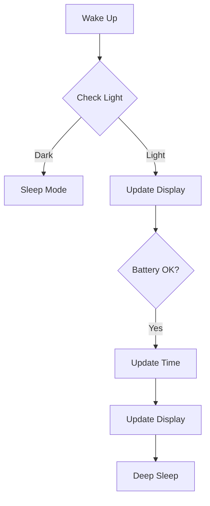

<div align="center">
  <h1>🌟 Minimalistic E-Paper NTP-RTC Clock 🕒</h1>
  <p>
    
    
    
    
  </p>
  <p>
    
    <a href="/LICENSE"></a>
    <a href="https://github.com/desiFish/ESP32-ePaper-Display-NTP-Clock/issues"></a>
    <a href="https://github.com/desiFish/ESP32-ePaper-Display-NTP-Clock/releases"></a>
  </p>
</div>

> 🚨 **IMPORTANT**: Please read the [Notes & Warnings] section carefully before proceeding with this project. It contains crucial safety information about battery configuration, charging, and sensor placement.

<summary>🎯 System Specifications</summary>

<div align="center">
<table>
  <tr>
    <th colspan="2">🖥️ Core Components</th>
  </tr>
  <tr>
    <td>🧠 Microcontroller</td>
    <td>Xiao ESP32 C6 (Compatible with most ESP32 boards)</td>
  </tr>
  <tr>
    <td>📺 Display</td>
    <td>Waveshare 3.52" BiColor (Black and White) E-paper (360x240)</td>
  </tr>
  <tr>
    <td>🔋 Power Source</td>
    <td>LiFePO4 6000mAh 3.2V</td>
  </tr>
</table>

<table>
  <tr>
    <th colspan="2">⚡ Power Specifications</th>
  </tr>
  <tr>
    <td>Operating Voltage</td>
    <td>~3.2V</td>
  </tr>
  <tr>
    <td>Sleep Duration</td>
    <td>~60 seconds</td>
  </tr>
  <tr>
    <td>Battery Thresholds</td>
    <td>
      📈 High: 3.4V<br>
      📉 Low: 2.9V
    </td>
  </tr>
</table>

<table>
  <tr>
    <th colspan="2">🔌 Communication</th>
  </tr>
  <tr>
    <td>I2C Speed</td>
    <td>400kHz (Fast Mode)</td>
  </tr>
  <tr>
    <td>NTP Server</td>
    <td>asia.pool.ntp.org</td>
  </tr>
  <tr>
    <td>Time Offset</td>
    <td>19800 (India, UTC+5:30)</td>
  </tr>
</table>
</div>

## 🛠️ Hardware Components <sub><sup>🔩 Parts List</sup></sub>
<table>
<tr>
  <th>Component</th>
  <th>Specifications</th>
  <th>Details</th>
</tr>
<tr>
  <td><br>Xiao ESP32 C6</td>
  <td>
    • MCU: ESP32-C6 RISC-V<br>
    • Clock: 160MHz<br>
    • RAM: 512KB SRAM<br>
    • Flash: 4MB<br>
    • WiFi: 2.4GHz (WiFi6)<br>
    • Bluetooth: BLE 5.0<br>
    • Size: 21x17.8mm<br>
    • Deep Sleep: ~16µA (when powered via BAT pins)<br>
  </td>
  <td>Note: Deep sleep current specified when battery connected to BAT pins</td>
</tr>
<tr>
  <td><br>Waveshare 3.52" E-Paper</td>
  <td>
    • Resolution: 360x240<br>
    • Colors: BiColor<br>
    • Refresh: 1.5 secs
  </td>
  <td>Display unit with low power consumption</td>
</tr>
<tr>
  <td><br>BH1750</td>
  <td>
    • I2C Address: 0x23<br>
    • Mode: ONE_TIME_HIGH_RES<br>
    • Precision: 1-65535 lux
  </td>
  <td>Ambient light sensor for night mode</td>
</tr>
<tr>
  <td><br>DS3231</td>
  <td>
    • Accuracy: ±2ppm<br>
    • Temperature comp.<br>
    • Battery backup
  </td>
  <td>Real-time clock for timekeeping</td>
</tr>
<tr>
  <td><br>IFR32650 LiFePO4</td>
  <td>
    • Model: IFR32650<br>
    • Capacity: 6000mAh<br>
    • Voltage: 3.2V nominal<br>
    • Chemistry: LiFePO4<br>
    • Cycle Life: >2000 cycles<br>
    • Size: 32x65mm<br>
    • Max Discharge: 2C<br>
    • Temperature Range: -20°C to 60°C<br>
    • Self-discharge: 3% per month
  </td>
  <td>High-capacity, safe chemistry battery with long cycle life and stable voltage output</td>
</tr>
<tr>
  <td><br>TP5000</td>
  <td>
    • Input: 5V USB<br>
    • Output: 3.2V<br>
    • Current: Up to 2A
  </td>
  <td>Battery charging module</td>
</tr>
<tr>
  <td><br>USB-C Breakout</td>
  <td>
    • USB 2.0 Compatible<br>
    • 5V Input<br>
    • Data lines available
  </td>
  <td>Power input and debugging interface</td>
</tr>
</table>

## 💫 Key Features ✨
<div align="center">
  <table>
    <tr>
      <td align="center">⚡️<br><span style="color: #4CAF50">Power Efficient</span></td>
      <td align="center">🌙<br><span style="color: #2196F3">Night Mode</span></td>
      <td align="center">🔄<br><span style="color: #FF9800">Auto Update</span></td>
      <td align="center">📊<br><span style="color: #9C27B0">Battery Monitor</span></td>
    </tr>
    <tr>
      <td><span style="color: #4CAF50">~60s Deep Sleep</span></td>
      <td><span style="color: #2196F3">Light Sensor Based</span></td>
      <td><span style="color: #FF9800">Periodic NTP Sync</span></td>
      <td><span style="color: #9C27B0">Voltage Tracking</span></td>
    </tr>
  </table>
</div>

## 📈 System Architecture 🔄


## 🚀 Quick Start 🎯
<details>
<summary>Prerequisites</summary>

```yaml
Required Libraries:
  - Check header section inside .ino file
  - OEM Display Libraries (Included in src)
```
</details>

<details>
<summary>Installation Steps</summary>

1. Clone repository
2. Configure WiFi:
```cpp
const char *ssid = "Your_SSID";
const char *password = "Your_PASSWORD";
```
3. Update pins in `src/epdif.h`
4. Upload code
</details>

## 🔋 Battery Performance ⚡
<div align="center">
<details>
<summary>📊 Battery Life Analysis - Test #1 (With ESP32 C3)</summary>
<table>
  <tr>
    <th colspan="4"></th>
  </tr>
  <tr>
    <td><strong>Start Date</strong></td>
    <td><strong>End Date</strong></td>
    <td><strong>Runtime</strong></td>
    <td><strong>Status</strong></td>
  </tr>
  <tr>
    <td>June 6, 2024</td>
    <td>November 1, 2024</td>
    <td>4 months 27 days</td>
    <td>✅ Completed</td>
  </tr>
  <tr>
    <td colspan="4">
      <strong>Performance Metrics</strong><br>
      🔋 Initial Voltage: 3.6V<br>
      📉 Final Voltage: ~2.84V<br>
      🌡️ Temperature Range: 17-38°C
    </td>
  </tr>
</table>
</details>

<br>

<details>
<summary>📊 Battery Life Analysis - Test #2 (With ESP32 C3)</summary>
<table>
  <tr>
    <td><strong>Start Date</strong></td>
    <td><strong>End Date</strong></td>
    <td><strong>Runtime</strong></td>
    <td><strong>Status</strong></td>
  </tr>
  <tr>
    <td>November 1, 2024</td>
    <td>April 2, 2025</td>
    <td>5 months 2 days</td>
    <td>✅ Completed</td>
  </tr>
  <tr>
    <td colspan="4">
      <strong>Performance Metrics</strong><br>
      🔋 Initial Voltage: 3.6V<br>
      📉 Final Voltage: 2.79V<br>
      🌡️ Temperature Range: 15-36°C
    </td>
  </tr>
</table>
</details>

<br>

<table>
  <tr>
    <th colspan="4">📊 Battery Life Analysis - Test #3 (With ESP32 C6)</th>
  </tr>
  <tr>
    <td><strong>Start Date</strong></td>
    <td><strong>End Date</strong></td>
    <td><strong>Runtime</strong></td>
    <td><strong>Status</strong></td>
  </tr>
  <tr>
    <td>April 6, 2025</td>
    <td>September 8, 2025</td>
    <td>5 months 2 days</td>
    <td>✅ Completed</td>
  </tr>
  <tr>
    <td colspan="4">
      <strong>Performance Metrics</strong><br>
      🔋 Initial Voltage: 3.54V<br>
      📉 Final Voltage: 2.8V<br>
      🌡️ Temperature Range: 26-36°C
    </td>
  </tr>
</table>

<br>

<table>
  <tr>
    <th colspan="4">📊 Battery Life Analysis - Test #4 (With ESP32 C6)</th>
  </tr>
  <tr>
    <td><strong>Start Date</strong></td>
    <td><strong>End Date</strong></td>
    <td><strong>Runtime</strong></td>
    <td><strong>Status</strong></td>
  </tr>
  <tr>
    <td>Feb 4, 2026</td>
    <td>TBD</td>
    <td>TBD</td>
    <td>ONGOING</td>
  </tr>
  <tr>
    <td colspan="4">
      <strong>Performance Metrics</strong><br>
      🔋 Initial Voltage: 3.54V<br>
      📉 Final Voltage: TBD<br>
      🌡️ Temperature Range: 17-TBD°C
    </td>
  </tr>
</table>
</div>

## 📸 Gallery 🖼️
<div align="center">
<table border="0" cellspacing="0" cellpadding="10">
  <tr>
    <td align="center">
      <br>
      <sub>Front 1</sub>
    </td>
    <td align="center">
      <br>
      <sub>Side 1</sub>
    </td>
    <td align="center">
      <br>
      <sub>Back</sub>
    </td>
    <td align="center">
      <br>
      <sub>Front 2</sub>
    </td>
  </tr>
  <tr>
    <td align="center">
      <br>
      <sub>Inside 1</sub>
    </td>
    <td align="center">
      <br>
      <sub>Inside 2</sub>
    </td>
    <td align="center">
      <br>
      <sub>New UI</sub>
    </td>
    <td align="center">
      <br>
      <sub>ESP32 C3 & C6</sub>
    </td>
  </tr>
  <tr>    
    <td align="center">
      <br>
      <sub>New Sleep UI</sub>
    </td>
    <td align="center">
      <br>
      <sub>Inside 4</sub>
    </td>
    <td align="center">
      <br>
      <sub>Inside 5</sub>
    </td>
     <td align="center">
      <br>
      <sub>Inside 6</sub>
    </td>
  </tr>
  <tr>
    <td align="center" colspan="4">
      <br>
      <sub>Circuit Schematic</sub>
    </td>
  </tr>
</table>
</div>

## ⚙️ Development 🔧
<details>
<summary>Build Requirements</summary>

- 💻 Arduino IDE 2.3.x or newer (tested)
- 📦 ESP32 Board Support Package
- 🔧 USB-C cable for programming
- 📚 Required libraries (see Prerequisites)
</details>

<details>
<summary>Debug Tips</summary>

- 🔍 Serial Monitor: 115200 baud
- 📊 Test points available for voltage monitoring (just lift the cover)
</details>

## 🌐 Connectivity 📡
- 📡 WiFi6 2.4GHz
- 🕒 NTP synchronization
- 💤 Auto sleep when dark

### 🌙 Deep Sleep Implementation with DS3231 RTC
> ⚠️ **Important Note**: No single source provided a complete working solution for deep sleep with DS3231 RTC. This implementation combines key elements from multiple references to create a reliable solution.

The project implements an efficient deep sleep mode using the DS3231 RTC's external alarm feature. This approach significantly reduces power consumption while maintaining accurate timekeeping.

#### How it Works
1. The DS3231 RTC SQW pin is connected to GPIO7 (MTDO) (RTC GPIO)
2. The RTC alarm triggers a signal on the SQW pin
3. ESP32-C6 wakes up from deep sleep on the falling edge

#### Key Implementation Points
- Wake-up Source: `esp_sleep_enable_ext0_wakeup(GPIO_NUM_7, 0)`
- Wake Up Interval: 60 seconds (configurable)
- Current Consumption: ~16µA in deep sleep (for XIAO ESP32C6 only)

#### References
These sources were combined to create a working implementation:
1. [ESP32 Wake-Up Using DS3231 RTC](https://randomnerdtutorials.com/esp32-wake-up-deep-sleep-external-alarms-ds3231/) - Basic RTC alarm setup
2. [XIAO ESP32C6 Deep Sleep Guide](https://wiki.seeedstudio.com/xiao_esp32c6_getting_started/#demo1-deep-sleep-with-external-wake-up) - ESP32-C6 specific wake-up configuration
3. [ESP32 External Wake-Up Implementation](https://randomnerdtutorials.com/esp32-external-wake-up-deep-sleep/) - External wake-up pin handling

## ⚠️ Important Notes & Warnings 🚨

### 🔄 DS3231 Battery Safety ⚡
<div align="center">
<br>
Most DS3231 modules are sold with CR2032 or similar cells which are not rechargeable. If you are using a non-rechargeable cell then **REMOVE** either the resistor or the diode marked in the above image.
</div>

### 🔌 TP5000 Charging Configuration ⚡
<div align="center">
<br>
There are some misinformation over internet regarding the charging mode of TP5000. If you are going to use LiFePO4 cell with TP5000 then **DO NOT** short the above marked area with caption F.
</div>

### 🔋 Battery Configuration Safety 🛡️

### Power Management Considerations
- ⚡ **Current Draw**: This project's extremely low current consumption (well below rated cell capacity) makes the cell configuration safer
- 🛡️ **Protection**: Always use proper BMS protection for your cells
- 📝 **BMS Setup**: Due to limited 1S LiFePO4 BMS availability:
  - Using 4.2V BMS for 2.5V cutoff protection (Low Discharge Cutoff)
  - TP5000 connected directly to the cell for proper 3.6V charging
  - This is a temporary solution until better 1S LFP BMS options become available

### USB Charging Safety
- ⚡ **USB Connection Warning**: Disconnect battery when connecting USB to ESP32C6 (Use a switch to cutt-off battery)
  - XIAO modules are designed for LiPo/Li-ion batteries (4.2V charging)
  - Not compatible with LFP battery charging (3.6V required)
  - Connect USB-C module output to TP5000 input
  - Detailed schematics will be provided later
  - Simple setup despite complex explanation

### Voltage Compatibility
- ✅ **Operating Range**: 
  - All components work perfectly with LFP's lower voltage
  - Tested operational down to 2.8V
  - No impact on battery life or performance
  - LFP cells maintain stable 3.2V for extended periods
  - 6+ months of testing
  - Components designed for wide voltage range operation

### Enclosure Design
- 💨 **Ventilation Requirements**: 
  - Proper air vents are crucial
  - Ensures accurate sensor readings
  - Prevents heat buildup

> ⚠️ **Please consider these points carefully before replicating this setup. Battery safety is crucial!**
---

## 📜 License 📃
<details>
<summary>GNU General Public License v3.0</summary>

This project is licensed under the GNU GPL v3.0 - see below for details:

- ✅ Commercial use
- ✅ Modification
- ✅ Distribution
- ✅ Patent use
- ✅ Private use

#### Limitations
- ⚠️ Liability
- ⚠️ Warranty
- ℹ️ License and copyright notice required
- ℹ️ State changes
- ℹ️ Disclose source
- ℹ️ Same license

[Read full license](/LICENSE)
</details>

## 🤝 Contributing 👥
We welcome contributions! Here's how you can help:

1. 🔍 Fork the repository
2. 🌿 Create your feature branch (`git checkout -b feature/AmazingFeature`)
3. 💾 Commit your changes (`git commit -m 'Add some AmazingFeature'`)
4. 🚀 Push to the branch (`git push origin feature/AmazingFeature`)
5. 📝 Open a Pull Request

### Pull Request Guidelines
- ✅ Clear description of changes
- ✅ Test your changes thoroughly
- ✅ Update documentation if needed
- ✅ Follow existing code style
- ✅ Add comments where necessary
---
<div align="center">
<p>Made with ❤️ and ♻️ materials by 🌍 Earth-conscious developer</p>
</div>
